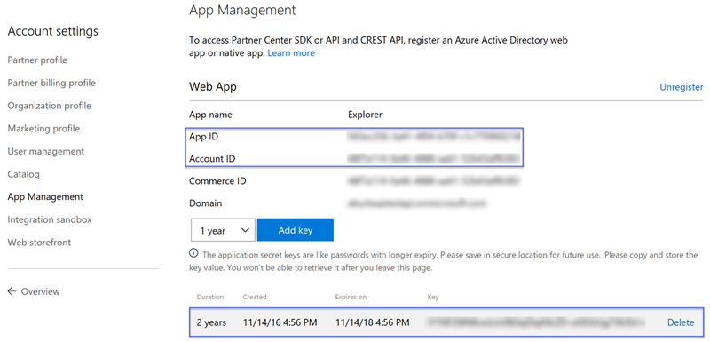
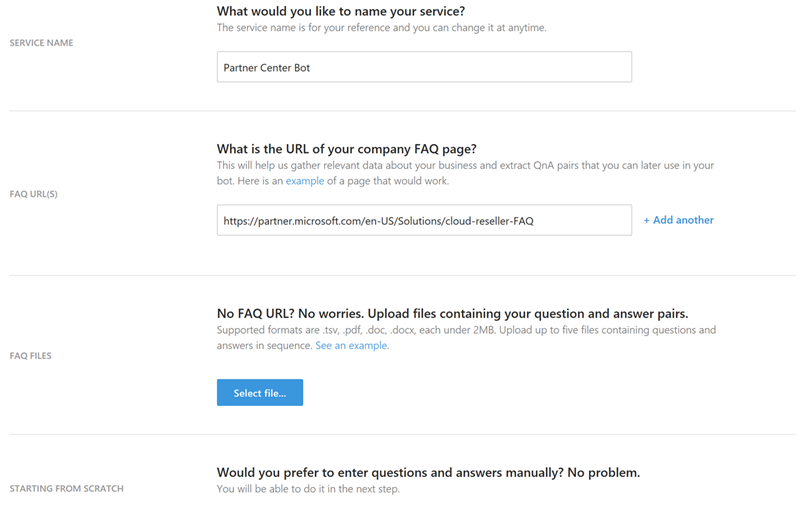

# Deployment 
Deploying and configuring the Partner Center Bot requires numerous configurations. This document will guide you through each of the
configurations. If you need help please log an issue using the [issue tracker](https://github.com/Microsoft/Partner-Center-Bot/issues).

## Prerequisites 
The following are _required_ prerequisites in order to perform the steps outlined in this guide. 

| Prerequisite                            | Purpose                                                                                 |
|-----------------------------------------|-----------------------------------------------------------------------------------------|
|  Azure AD global admin privileges       | Required to create the required Azure AD application utilized to obtain access tokens.  |
|  Partner Center admin agent privileges  | Required to perform various Partner Center operations through the Partner Center API.   |

If you do not have the privileges then you will not able to perform the remaining operations in this guide.

## Partner Center Azure AD Application
The Partner Center API is utilized to verify the authenticated user belongs to a customer that has a relationship with the configured partner. Perform the following to create the application 

1. Login to the [Partner Center](https://partnercenter.microsoft.com) portal using credentials that have _AdminAgents_ and _Global Admin_ privileges
2. Click _Dashboard_ -> _Account Settings_ -> _App Management_ 
3. Click on _Register existing_ app if you want to use an existing Azure AD application, or click _Add new web app_ to create a new one

    

4. Document the _App ID_ and _Account ID_ values. Also, if necessary create a key and document that value. 

    

## Creating the Bot Azure AD Application
The bot requires an Azure AD application that grants privileges to Azure AD and the Microsoft Graph. Perform the following tasks to create and configure the application 

1. Login to the [Azure Management portal](https://portal.azure.com) using credentials that have _Global Admin_ privileges
2. Open the _Azure Active Directory_ user experience and then click _App registration_

    

3. Click _+ Add_ to start the new application wizard
4. Specify an appropriate name for the bot, select _Web app / API_ for the application, an appropriate value for the sign-on URL, and then click _Create_
5. Click _Required permissions_ found on the settings blade for the application and then click _+ Add_ 
6. Add the _Microsoft Graph_ API and grant it the _Read directory data_ application permission
7. Add the _Partner Center API_  and grant it the _Access Partner Center PPE_ delegated permission

    

8. Click _Grant Permissions_, found on the _Required Permissions_ blade, to consent to the application for the reseller tenant 

    

9. Enable pre-consent for this application by completing the steps outlined in the [Pre-consent](Preconsent.md) documentation.

## Create a New LUIS Application
Perform the following to create and configure the Language Understanding Intelligent Service (LUIS) application

1. Browse to https://www.luis.ai/ and login using an appropriate account 
2. Click the *Import App* button to import the [Partner-Center-Bot.json](../Partner-Center-Bot.json) file
3. Train and publish the application. Be sure to document the application identifier and subscription key

Please checkout [Publish your app](https://docs.microsoft.com/en-us/azure/cognitive-services/LUIS/publishapp) for more information.

## Create a New Instance of the QnA Service 
Perform the following in order to create a new instance of the QnA service

1. Browse to https://qnamaker.ai/ and login using an appropriate account
2. Click the _Create new service_ link found at the top of the page
3. Complete the form as necessary

    

4. Click the _Create_ button at the bottom of the page to create the service
5. Make any necessary modifications to the knowledge question and answer pairs
6. Click the _Save and retrain_ button to apply any changes you made and then click the _Publish_ button
7. Click the _Publish_ button and then document the knowledge base identifier and subscription key

    

## Register With the Bot Framework
Registering the bot with the framework is how the connector service knows how to interact with the bot's web service. Perform the 
following to register the bot and update the required configurations

1. Go to the Microsoft Bot Framework portal at https://dev.botframework.com and sign in.
2. Click the "Register a Bot" button and fill out the form. Be sure to document the application identifier and password that you generate as part of this registration. 

## Deploy the ARM Template 
An Azure Resource Manager (ARM) template has been developed in order to simplify the deployment of the solution. When you click the 
*Deploy to Azure* below it will take you to a website where you can populate the parameters for the template. 

The following table provides details for the appropriate value for each of the parameters.

| Parameter                             | Value                                                                                                    |
|---------------------------------------|----------------------------------------------------------------------------------------------------------|
| Application Id                        | Identifier for the application created in the Azure AD Application section                               |
| Application Secret                    | Secret key create in the step 9 of the Azure AD application section                                      |
| Application Tenant Id                 | Identifier for the tenant where the application from the Azure AD Application was created                |
| LUIS App Id                           | Identifier for the LUIS application created in the *Create a New LUIS Application* section               |
| LUIS App Key                          | Key for the LUIS application created in the *Create a New LUIS Application* section                      |
| Microsoft App Id                      | Identifier of the application created in the *Register With the Bot Framework* section                   |
| Micorosoft App Password               | Password of the application created in the *Register With the Bot Framework* section                     |
| Partner Center Application Id         | App ID value obtained from the Partner Center Azure AD Application section                               |
| Partner Center Application Secret     | Key created in the Partner Center Azure AD Application section                                           | 
| Partner Center Application Tenat Id   | Account ID value obtained from the Partner Center Azure AD Application section                           |
| QnA Knowledgebase Id                  | Identifier for the knowledgebase created in the *Create a New Instance of the QnA Service* section       |
| QnA Subscription Key                  | Subscription key for the knowledgebase created in the *Create a New Instance of the QnA Service* section |
